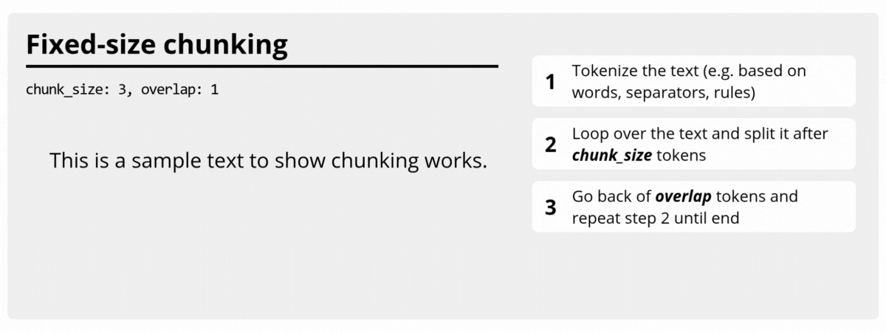
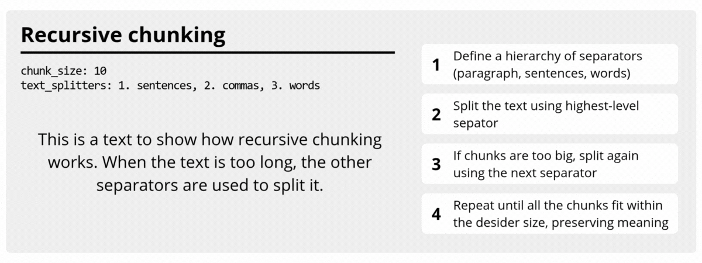
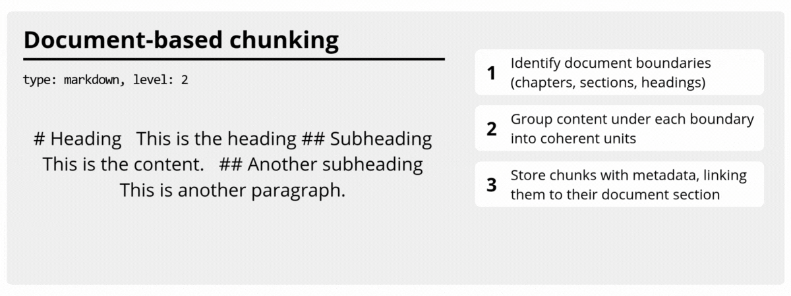
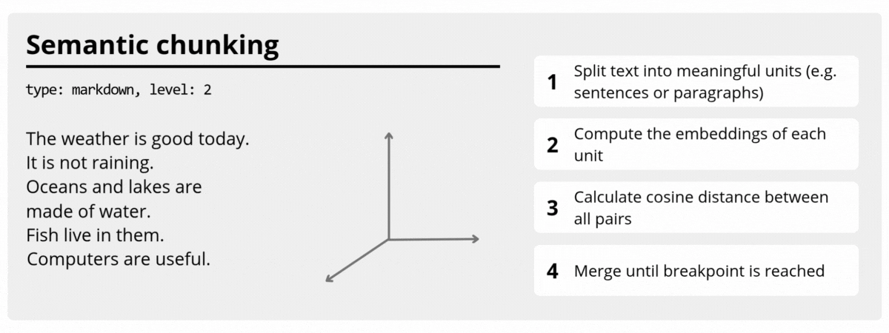
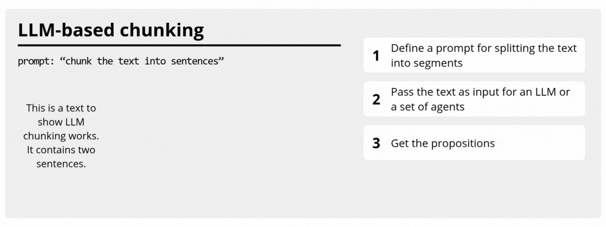

Overview
===============

Text chunkers define *how* a long text is divided into chunks before storage,
embedding, retrieval, or prompt construction. In ``chunkipy``, each chunker
shares the same base interface but follows a different splitting philosophy,
from deterministic windows to structure-aware recursive strategies.

Use this page as a quick visual comparison of current and roadmap chunkers.
Even when features are shown in multiple pages, keeping the animated previews
here helps you choose faster.

When needed, you can implement your own chunker by extending
:class:`BaseTextChunker <chunkipy.text_chunker.BaseTextChunker>` and plugging in
your custom splitting and sizing logic.

See :doc:`custom` for a custom chunker template.

.. sidebar:: Chunker classes

   - :class:`BaseTextChunker <chunkipy.text_chunker.BaseTextChunker>`
   - :class:`FixedSizeTextChunker <chunkipy.text_chunker.FixedSizeTextChunker>`
   - :class:`RecursiveTextChunker <chunkipy.text_chunker.RecursiveTextChunker>`
   

Chunkers
----------------

FixedSizeTextChunker
^^^^^^^^^^^^^^^^^^^^^

:class:`FixedSizeTextChunker <chunkipy.text_chunker.FixedSizeTextChunker>` builds
chunks with a fixed target size using the configured size estimator. It is ideal
when you want stable chunk lengths and predictable overlap behavior.

RecursiveTextChunker
^^^^^^^^^^^^^^^^^^^^^

:class:`RecursiveTextChunker <chunkipy.text_chunker.RecursiveTextChunker>`
applies splitters recursively (from coarser to finer separators) to keep chunks
within the desired size while preserving more natural text boundaries.

DocumentBasedTextChunker (Roadmap)
^^^^^^^^^^^^^^^^^^^^^^^^^^^^^^^^^^^

A planned chunker focused on document structure (sections, paragraphs,
headings), useful for markdown, HTML, and rich formatted sources.

SemanticTextChunker (Roadmap)
^^^^^^^^^^^^^^^^^^^^^^^^^^^^^^

A planned chunker based on semantic similarity between adjacent text units,
designed to preserve contextual coherence for embeddings and RAG pipelines.

LLMBasedChunker (Roadmap)
^^^^^^^^^^^^^^^^^^^^^^^^^^

A planned LLM-driven chunker that uses model reasoning to identify meaningful
split points based on topic, discourse, and context.

